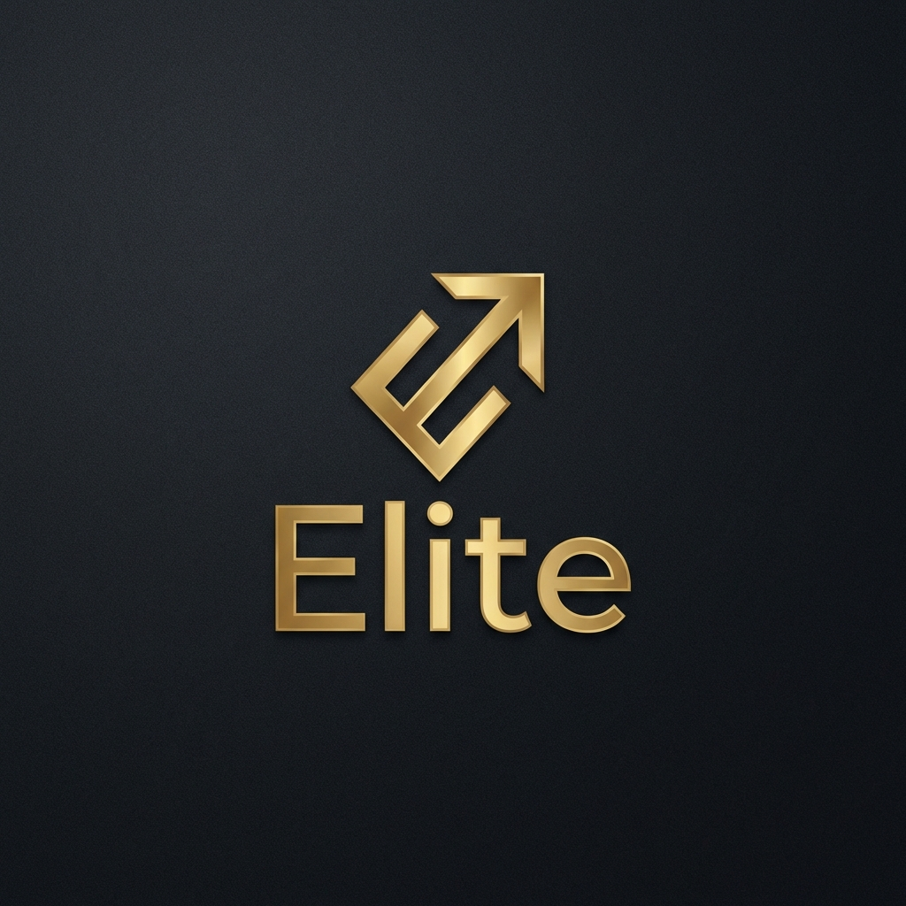

# 🏆 Elite Premium Enterprise Mobile App



## 💎 Sobre o Projeto

O **Elite Premium** é uma solução móvel de alto padrão desenvolvida especificamente para empresas de médio e grande porte. O foco principal é oferecer uma experiência de usuário luxuosa, performance excepcional e segurança de dados rigorosa, em total conformidade com a **LGPD (Lei Geral de Proteção de Dados)**.

Este aplicativo é ideal para vendas, gestão de negócios e análise de métricas em ambientes corporativos que exigem sofisticação e confiabilidade.

---

## ✨ Funcionalidades Principais

### 🌍 Internacionalização (i18n)

Suporte nativo a quatro idiomas, configurável em tempo real:

- 🇧🇷 **Português (PT)**
- 🇺🇸 **Inglês (EN)**
- 🇪🇸 **Espanhol (ES)**
- 🇯🇵 **Japonês (JP)**

### 📊 Dashboards Analíticos

Painéis interativos com gráficos dinâmicos para visualização de KPIs, lucros e performance de mercado, garantindo 100% de responsividade em **Smartphones e Tablets**.

### 🔐 Segurança de Ponta (Padrão LGPD)

- **Cofre Seguro**: Implementação de criptografia 256-bit para dados sensíveis.
- **Row Level Security (RLS)**: Proteção de dados a nível de banco de dados via Supabase.
- **Integridade de Dados**: Verificação constante para conformidade jurídica.

### 🎨 Design System "Elite UX"

- Paleta de cores moderna: **Ouro (D4AF37)**, **Carvão Profundo (121212)** e **Prata (E0E0E0)**.
- Layout inovador com efeitos de **Glassmorphism** e micro-animações fluidas.

---

## 🛠 Stacks Tecnológicas

- **Core**: [React Native](https://reactnative.dev/) + [Expo](https://expo.dev/) (Managed Workflow)
- **Linguagem**: [TypeScript](https://www.typescriptlang.org/)
- **Estilização**: [NativeWind](https://www.nativewind.dev/) (Tailwind CSS para React Native)
- **Base de Dados**: [Supabase](https://supabase.com/) (PostgreSQL)
- **Ícones**: [Lucide React Native](https://lucide.dev/)
- **Gráficos**: [React Native Chart Kit](https://github.com/indiespirit/react-native-chart-kit)
- **Navegação**: [Expo Router](https://docs.expo.dev/router/introduction/) (Link-based routing)

---

## 🚀 Como Iniciar

### Pré-requisitos

- Node.js instalado.
- Expo Go instalado no seu dispositivo móvel (ou um emulador).

### Instalação

1. Clone este repositório:

   ```bash
   git clone https://github.com/Shinzo-Suzuki-Filho/CRM.git
   ```

2. Acesse a pasta do projeto:

   ```bash
   cd CRM
   ```

3. Instale as dependências:

   ```bash
   npm install
   ```

### Execução

Inicie o servidor de desenvolvimento:

```bash
npx expo start
```

Escaneie o QR Code gerado com o app **Expo Go** no seu celular para testar a experiência Elite Premium.

---

## 📦 Documentação Complementar

Para detalhes técnicos e guias de uso, consulte:

- [Guia de Funcionalidades (WalkThrough.md)](WalkThrough.md)
- [Plano de Implementação.md](Plano%20de%20Implementa%C3%A7%C3%A3o.md)
- [Lista de Tarefas Concluídas (Task.md)](Task.md)

---

## 🤝 Contato e Deploy

Desenvolvido por **Shinzo Suzuki & Antigravity AI**. Prepare-se para surpreender seus compradores com o desempenho deste aplicativo.

---
© 2026 Elite Premium Enterprise. Todos os direitos reservados.
